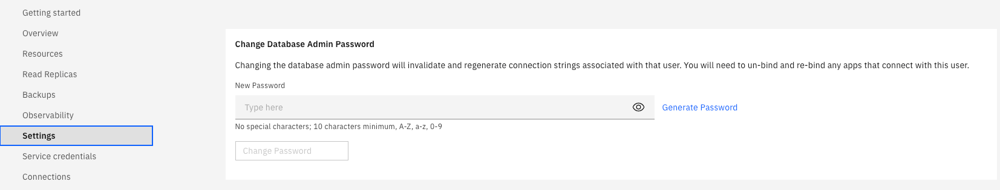

---
copyright:
  years: 2020, 2022
lastupdated: "2022-10-20"

keywords: admin password, credentials, cassandra, datastax admin password, dse

subcollection: databases-for-cassandra

---

{{site.data.keyword.attribute-definition-list}}

# Setting the Admin Password
{: #admin-password}

{{site.data.keyword.databases-for-cassandra_full}} is deprecated and no longer supported as of 30 June 2024. For more information, see the [deprecation details](/docs/databases-for-cassandra?topic=databases-for-cassandra-deprecation#dep_details).
{: deprecated}

The {{site.data.keyword.databases-for-cassandra}} service is provisioned with an admin user.

You must set the admin password before you use it to connect. To set the password through the {{site.data.keyword.cloud_notm}} dashboard, select _Manage_ from the service dashboard to open the management pane for your service. Open the _Settings_ tab, and use the _Change Database Admin Password_ pane to set a new admin password.

{: caption="Figure 1. The Change Database Admin Password pane" caption-side="bottom"}

## Setting the admin password through the command line
{: #admin-password-cli}
{: cli}

Use the `cdb user-password` command from the [{{site.data.keyword.databases-for-cassandra}} CLI plug-in](/docs/databases-cli-plugin?topic=databases-cli-plugin-cdb-reference) to set the admin password with the command line.

For example, to set the admin password for a deployment named "example-deployment", use the following command.
```sh
ibmcloud cdb user-password example-deployment admin <newpassword>
```
{: pre}

## Setting the admin password through the API
{: #admin-password-api}
{: api}

The _Foundation Endpoint_ that is shown on the _Overview_ pane of your service provides the base URL to access this deployment through the API. Use it with the `/deployments/{id}/users/{username}` endpoint to set the admin password.

```sh
curl -X PATCH `https://api.{region}.databases.cloud.ibm.com/v4/ibm/deployments/{id}/users/admin' \
-H "Authorization: Bearer $APIKEY" \
-H "Content-Type: application/json" \
-d '{"password":"newrootpasswordsupersecure21"}'
```
{: pre}

For more information, see the [API Reference](https://{DomainName}/apidocs/cloud-databases-api#set-database-level-user-s-password).
