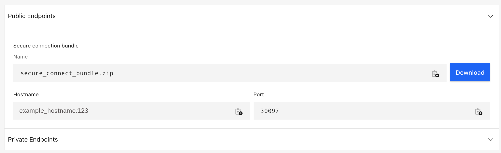

---
copyright:
  years: 2017, 2022
lastupdated: "2022-10-20"

keywords: databases, cassandra, datastax, dse, cassandra connection strings, datastax connection strings

subcollection: databases-for-cassandra

---

{:external: .external target="_blank"}
{:shortdesc: .shortdesc}
{:screen: .screen}
{:codeblock: .codeblock}
{:pre: .pre}
{:tip: .tip}
{{site.data.keyword.attribute-definition-list}}

# Getting Connection Strings
{: #connection-strings}

To connect to {{site.data.keyword.databases-for-cassandra_full}}, you need some users and connection strings. Connection Strings for your deployment are displayed on the _Dashboard Overview_, in the _Endpoints_ pane. 

{: caption="Figure 1. Endpoints pane" caption-side="bottom"}

A {{site.data.keyword.databases-for-cassandra}} deployment is provisioned with an admin user, and after [setting the admin password](/docs/databases-for-cassandra?topic=databases-for-cassandra-admin-password), you can use its connection strings to connect to your deployment.
{: tip}

## Client connections
{: #client-connection}

Clicking the `Download` button in the Overview tab -> Connections section provides you with a `<formation_id>_<endpoint_type>.zip` file. This compressed file includes:
- All necessary Certificates
- All necessary JKS/truststore/keystore files so the Java client can connect.
- The location of the `host:port` endpoint to access the metadata service.

An example bundle:
```sh
ls src/main/resources/bundle
ca.crt         cert.pfx       identity.jks   trustStore.jks
cert           config.json    key
```

Example config.json:
```sh
cat src/main/resources/bundle/config.json | python3 -m json.tool
{
  "host": "fd21c05e-28db-4858-9d8f-66651da81d74.bktg0ujl08k42osvn5ig.databases.appdomain.cloud",
  "port": 31868,
  "keyspace": "system",
  "keyStorePassword": "Z8XIXlC+gW02vDtLRnvka6MXqPKf4RLl1vcU/GSoPac=",
  "trustStorePassword": "FPB40vxFET9pXZuqZ8qyWH3BpEO8KinYy4LIIpE1m4M=",
  "pfxCertPassword": "nPegtaZDiwjQFvvHKdIyxmW4A426qiY1gwc2cM5SLXk="
}
```

## Getting Connection Strings through the CLI 
{: #connection-strings-cli}
{: cli}

You can also grab connection strings from the [CLI](/docs/databases-cli-plugin?topic=databases-cli-plugin-cdb-reference#deployment-connections).
```sh
ibmcloud cdb deployment-connections example-deployment -u <newusername> [--endpoint-type <endpoint type>]
```
{: pre}

Full connection information is returned by the `ibmcloud cdb deployment-connections` command with the `--all` flag. To retrieve all the connection information for a deployment named "example-deployment", use the following command.
```sh
ibmcloud cdb deployment-connections example-deployment -u <newusername> --all [--endpoint-type <endpoint type>]
```
{: pre}

If you don't specify a user, the `deployment-connections` commands return information for the admin user by default. If you don't specify an endpoint type, the connection string returns the public endpoint by default. If your deployment has only a private endpoint, you must specify `--endpoint-type private` or the commands return an error. The user and endpoint type is not enforced. You can use any user on your deployment with either endpoint (if both exist on your deployment).

To use the `ibmcloud cdb` CLI commands, [install the {{site.data.keyword.databases-for}} plug-in](/docs/databases-for-mongodb?topic=databases-cli-plugin-cdb-reference#installing-the-cloud-databases-cli-plug-in).
{: .tip}

## Getting Connection Strings through the API
{: #connection-strings-api}
{: api}

To retrieve user's connection strings from the API, use the [`/users/{userid}/connections`](https://{DomainName}/apidocs/cloud-databases-api#discover-connection-information-for-a-deployment-f-e81026) endpoint. You must specify in the path which user and which type of endpoint (public or private) to use in the returned connection strings. The user and endpoint type is not enforced. You can use any user on your deployment with either endpoint (if both exist on your deployment).
```sh
curl -X GET -H "Authorization: Bearer $APIKEY" 'https://api.{region}.databases.cloud.ibm.com/v4/ibm/deployments/{id}/users/{userid}/connections/{endpoint_type}'
```
{: pre}

