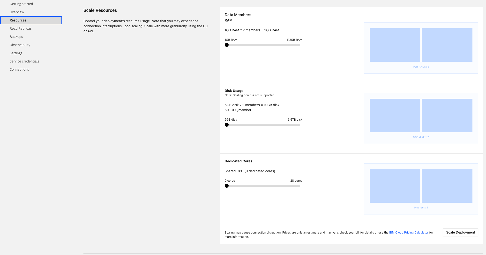

---

copyright:
  years: 2019, 2023
lastupdated: "2023-06-20"

keywords: databases, scaling, horizontal scaling, cassandra, datastax, dse, datastax horizontal scaling, cassandra horizontal scaling

subcollection: databases-for-cassandra

---

{{site.data.keyword.attribute-definition-list}}

# Adding DataStax Nodes
{: #horizontal-scaling}

{{site.data.keyword.databases-for-cassandra_full}} is deprecated and no longer supported as of 30 June 2024. For more information, see the [deprecation details](/docs/databases-for-cassandra?topic=databases-for-cassandra-deprecation#dep_details).
{: deprecated}

It is possible to scale your {{site.data.keyword.databases-for-cassandra_full}} deployment horizontally by adding more nodes, or members. If your deployment starts to strain or slow down, adding nodes increases capacity and reliability. When a node is added, {{site.data.keyword.databases-for-cassandra}} automatically balances the workload across all the nodes in your deployment.

Horizontal scaling can increase only disk and memory allotments. Nodes cannot be scaled down. 
{: .note}

Nodes that you add to your deployment are added with the amount of disk, memory, and CPU as the other nodes currently in your deployment. A visual representation of your data members and their resource allocation is available on the _Resources_ tab of your deployment's _Manage_ page. However, horizontal scaling is only available by using the API.

{: caption="Figure 1. The Scale Resources Pane" caption-side="bottom"}

A default {{site.data.keyword.databases-for-cassandra}} deployment runs with three data members in a cluster, and resources are allocated to all three members equally. For example, the minimum storage of a {{site.data.keyword.databases-for-cassandra}} deployment is 20480 MB per member, which equates to an initial size of 61440 MB. The minimum RAM for a {{site.data.keyword.databases-for-cassandra}} deployment is 12288 MB per member, which equates to an initial allocation of 36864 MB. The minimum dedicated cores per deployment are 6 per member, for an initial allocation of 18.

The benefits from horizontal scaling are only seen when scaling up in increments equal to the number of zones (or racks). As such, any horizontal upscaling should be done in increments of 3 (or to a multiple of 3), except in single-campus multizone regions. 

Billing is based on the _total_ amount of resources that are allocated to the service. 
{: .tip}

## Adding Nodes through the API
{: #horizontal-scaling-api}

The _Foundation Endpoint_ that is shown on the _Overview_ page of your service provides the base URL to access this deployment through the API.

To view the current and scalable resources on a deployment, use the [/deployments/{id}/groups](https://cloud.ibm.com/apidocs/cloud-databases-api#get-currently-available-scaling-groups-from-a-depl)
```sh
curl -X GET -H "Authorization: Bearer $APIKEY" `https://api.{region}.databases.cloud.ibm.com/v4/ibm/deployments/{id}/groups'
```

To add nodes, use the [/deployments/{id}/groups/{group_id}](https://cloud.ibm.com/apidocs/cloud-databases-api#set-scaling-values-on-a-specified-group) API endpoint, sending a PATCH request with the number of nodes you want in your deployment. The example request increases the number of nodes from the default of 3 to 5.
```sh
curl -X PATCH 'https://api.{region}.databases.cloud.ibm.com/v4/ibm/deployments/{id}/groups/member' \
-H 'Authorization: Bearer <>' \
-H 'Content-Type: application/json' \
-d '{"members": {"allocation_count": 5}}' \
```
